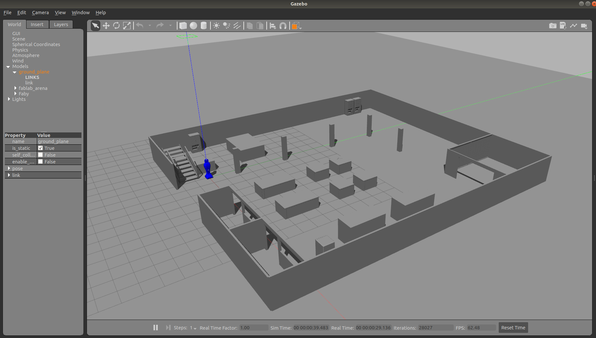
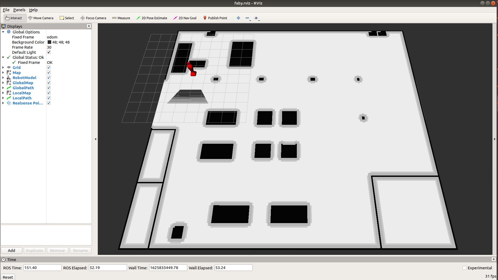
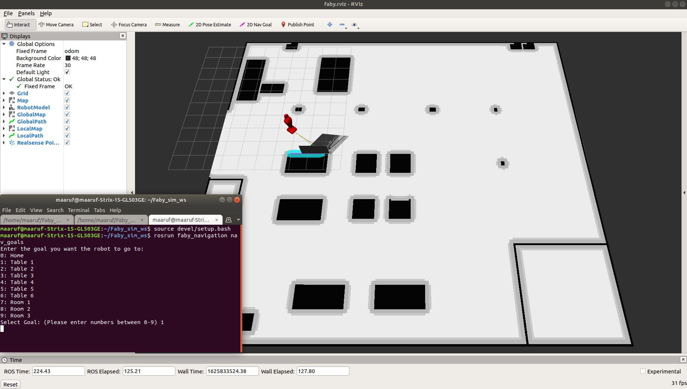
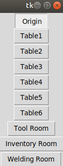
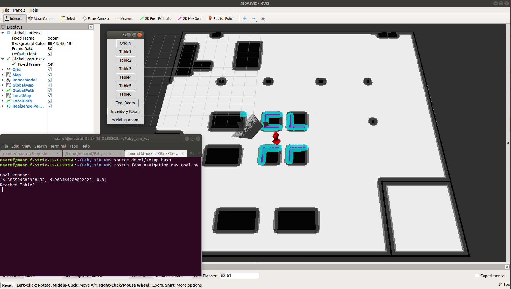

# Faby_sim

## Overview

Simulation of a telepresence robot - Faby in a fabrication lab environment.

* It contains a c++ script `nav_goals.cpp` that takes a number(which represents a goal location) as input from the user and sends Faby robot to that location.
* Some goal locations like the tables have multiple goal coordinates at different sides of the tables, so Faby will go the the goal coordinate which is closest to it.
* There is also a python script `nav_goal.py` which does the same using a simple GUI.

## Software Requirements

1. Ubuntu 18.04
2. ROS Melodic

## Build and Complie

To create a new workspace faby_ws, open a terminal and run the following commands:

``` bash
mkdir -p ~/faby_ws/src
cd ~/faby_ws/src/
git clone https://github.com/maarufvazifdar/faby_sim.git
cd ..
catkin_make
source devel/setup.bash
```

## Running the code

* After build and compile.

1. To launch gazebo simulation with Faby in the Fablab(a fabrication lab).

    ```bash
    cd ~/faby_ws
    source devel/setup.bash
    roslaunch faby_sim gazebo.launch
    ```
    * Output:
    

2. To launch the navigation stack and Rviz, open a new terminal and run the following commands:

    ``` bash
    cd ~/faby_ws
    source devel/setup.bash
    roslaunch faby_navigation navigation.launch 
    ```
    * Output:
    

3. To run `nav_goals.cpp`, open a new terminal and run the following commands:

    ``` bash
    cd ~/faby_ws
    source devel/setup.bash
    rosrun faby_navigation nav_goals 
    ```
    Then enter a number (from 0-9), 0 represents Home/Origin, 1 represents Tabel 1, and so on...  

    * Output: If you enter 5, Faby starts going towards Table 5.
    

4. To run `nav_goal.py`, open a new terminal and run the following commands:

    ``` bash
    cd ~/faby_ws
    source devel/setup.bash
    rosrun faby_navigation nav_goal.py 
    ```

    * Output:
        1. You will see a simple GUI.
         
        2. If you click 5, Faby starts going towards Table 5.
        